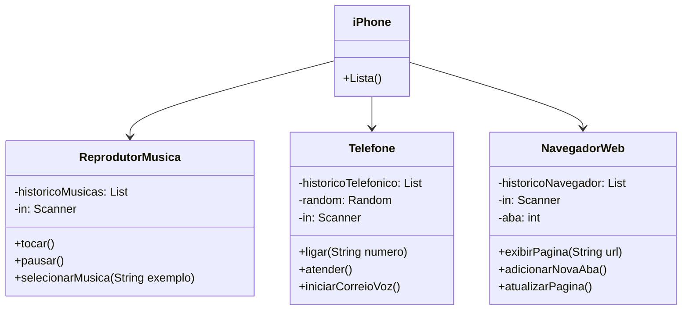

# Resolução do Desafio de Projeto

Este diretório contém a resolução de um desafio de projeto da DIO, referente à [Trilha Java Básico - POO](https://github.com/digitalinnovationone/trilha-java-basico/tree/main/desafios/poo).

## Diagrama UML das funcionalidades do projeto
